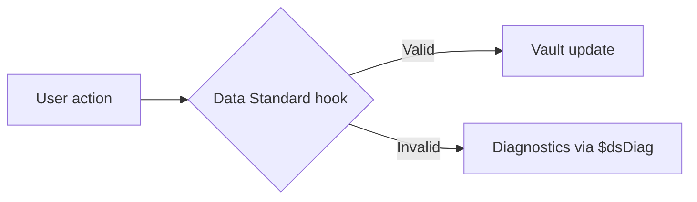

# Workflow recipe template

Use this template for longer, multi-phase automations such as the Four-Eyes lifecycle check or VGet batch download walkthroughs.

## Front matter checklist

- `title` – Verb + object ("Enforce Four-Eyes transitions").
- `description` – Outcome plus the systems you touch (Vault lifecycle, PowerShell, REST, etc.).
- `tags` – Include at least one of `governance`, `operations`, `cli`, or `data-standard`.

## Overview

Summarize the business case, pre-requisites, and success criteria. Link to any Autodesk policy references.

## Architecture diagram (optional)

Include a Mermaid diagram or image showing the flow between Vault, Data Standard, and any external tools.

## Ingredients

Break the requirements into **People**, **Tools**, and **Scripts**. Reference the [PowerShell Pantry](../reference/powershell-pantry.md) and [Debugging Playbook](../troubleshooting/debugging-playbook.md) when relevant.

## Phase 1 – Preparation

1. Checklist of configuration items.
2. Links to sample scripts or configuration files.

## Phase 2 – Implementation

1. Numbered steps that readers can execute sequentially.
2. Inline callouts for risk controls or audit checkpoints.

## Phase 3 – Validation & rollback

- Define smoke tests, user-acceptance criteria, and rollback levers.
- Provide commands for reverting configuration or disabling scripts quickly.

## Hand-off artifacts

Wrap up with references to:

- Issue templates or checklist downloads.
- Screenshots, logs, or exported configuration packages.
- Contact points for escalations.
