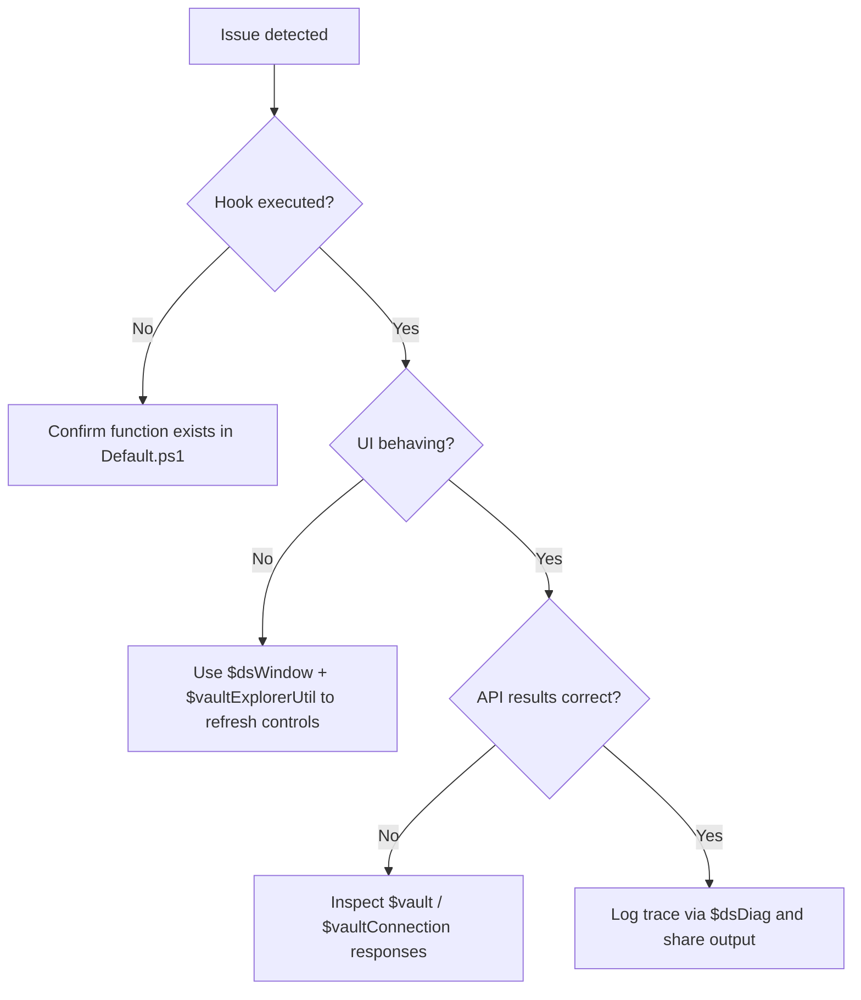

# Debugging Playbook

This playbook consolidates the diagnostics scattered across the Data Standard documentation so you can triage hook failures, UI glitches, and Vault-side errors without digging through multiple references.

## When a hook misbehaves

Use the following quick checks before diving into deep logs:

1. Confirm the function exists (and is exported) inside the correct `Default.ps1` file.
2. Turn on tracing with `$dsDiag.Trace()` to ensure the hook is actually executing.
3. Capture the dialog name via `$dsWindow.Name` so you know whether you are inside Inventor, AutoCAD, or Vault Explorer.

## Diagnostic helpers

| Helper | When to use | Copy-ready snippet |
| --- | --- | --- |
| `$dsDiag` | Hook fires but logic fails silently. | ```powershell
$dsDiag.Clear()
$dsDiag.Trace("OnPostCloseDialog started")
$dsDiag.ShowLog()
``` |
| `$vaultExplorerUtil` | Vault Explorer tabs do not refresh or selection looks stale. | ```powershell
$vaultExplorerUtil.RefreshSelection()
$vaultExplorerUtil.OpenFile($vaultContext.SelectedObject.Id, $false)
``` |
| `$vaultApplication` | UI needs a forced refresh (tab metadata, entity lists). | ```powershell
$vaultApplication.RefreshSelectedItems()
$vaultApplication.ShowMessage("Validation complete")
``` |

## Decision tree



## Sharing diagnostics

- Export `$dsDiag` output to HTML or copy/paste into the pull request.
- Attach screenshots of Vault Explorer after calling `$vaultExplorerUtil.RefreshSelection()` so reviewers can verify UI impact.
- Reference issue IDs when the trace highlights lifecycle or property configuration gaps.
